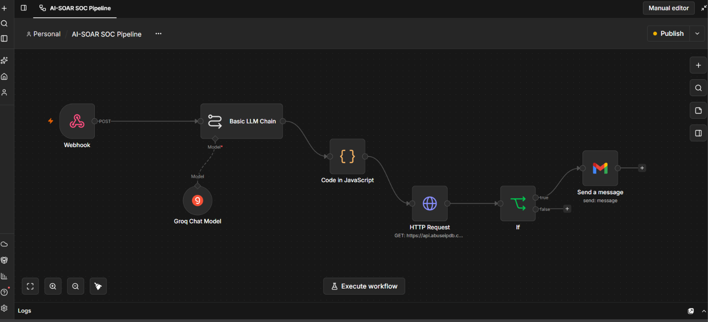

# 🚀 Autonomous AI-Driven SOC & SOAR Pipeline

An open-source, cost-effective Security Orchestration, Automation, and Response (SOAR) pipeline designed to automate threat triage, enrich threat intelligence, and deliver instant incident alerts—built as a B.Tech cybersecurity project.

---

## 🏗️ Architecture & Workflow
1. **Log Ingestion:** A lightweight Python telemetry forwarder running on an Ubuntu environment streams security events via Webhooks.
2. **Workflow Orchestration:** **n8n** manages the end-to-end event-driven data flow.
3. **AI Threat Triage:** **Groq LLM** analyzes behavioral indicators, evaluates risk scores, maps attacks to the **MITRE ATT&CK framework**, and generates actionable playbook recommendations.
4. **Threat Intelligence Enrichment:** Automatically queries **AbuseIPDB** to fetch real-time reputation scores, Tor exit node detection, and ISP data.
5. - **Conditional Severity Filtering:** The pipeline evaluates risk scores dynamically; for example, high-priority actions or automated containment playbooks can be conditionally triggered when risk scores exceed defined thresholds (e.g., > 50/100).
6. **Incident Response:** Dispatches a structured, automated SOC incident report straight to Gmail.
7. ### n8n Pipeline Automation Canvas


---

## 🛡️ Design Rationale & Enterprise Architecture

### Why Custom Telemetry Forwarding?
In enterprise security architectures, native SIEM automated alerting rules, webhook connectors, and advanced correlation features (such as Elastic Watcher) are frequently locked behind expensive tier-one enterprise licenses. To design a cost-effective, open-source alternative for this project, we bypassed commercial licensing barriers by building a lightweight Python security telemetry forwarder. This forwarder normalizes raw system logs into standardized JSON payloads and streams them directly into our n8n SOAR pipeline with zero licensing overhead.

---

## 🤖 L1 SOC Automation & Human-in-the-Loop Workflow

This project is modeled after real-world Tier 1 (L1) Security Operations Center workflows:

1. **Automated Alert Triage:** When an alert triggers, the pipeline instantly automates repetitive tasks that typically burden L1 analysts—such as querying global threat intelligence (AbuseIPDB), mapping attacks to the MITRE ATT&CK framework, and calculating risk scores.
2. **AI-Driven Playbook Guidance:** The Groq LLM analyzes the incident context and generates custom remediation recommendations.
3. **Human-in-the-Loop Validation:** While automation handles enrichment and triage at machine speed, critical validation and final judgment remain under human supervision. A security analyst reviews the structured incident report delivered via Gmail to confirm the severity before executing destructive actions.
4. **Automated Containment Actions:** For high-severity threats, the pipeline can extend beyond alerting to execute automated response actions—such as triggering endpoint isolation plays or blocking malicious IPs at the perimeter.

---

## 📂 Repository Structure
- `scripts/send_to_soc.py`: The security telemetry forwarder script.
- `workflows/ai_soar_pipeline.json`: The exported n8n workflow configuration.
- `demo/`: Contains demonstration video and architecture diagrams.

---

## 📊 Sample Automated Incident Report
```text
SECURITY OPERATIONS CENTER - AUTOMATED INCIDENT REPORT

[AI Triage Summary]
- Verdict: Suspicious - Needs Investigation
- MITRE ATT&CK: Execution: T1059.001 - PowerShell
- Risk Score: 55/100
- Summary: The alert shows PowerShell execution from an atypical user context, a common vector for credential theft or lateral movement. Additional investigation is required to determine if the activity is benign or malicious.

[Threat Intelligence Enrichment]
- Source IP: 185.220.101.5
- AbuseConfidenceScore: 100/100
- Tor Exit Node: true
- ISP / Organization: Artikel10 e.V.

[Automated SOAR Action & Playbook Guidance]
- Status: Automated Threat Mitigation Triggered
- Recommended SOC Action: Isolate Endpoint and block source IP.
